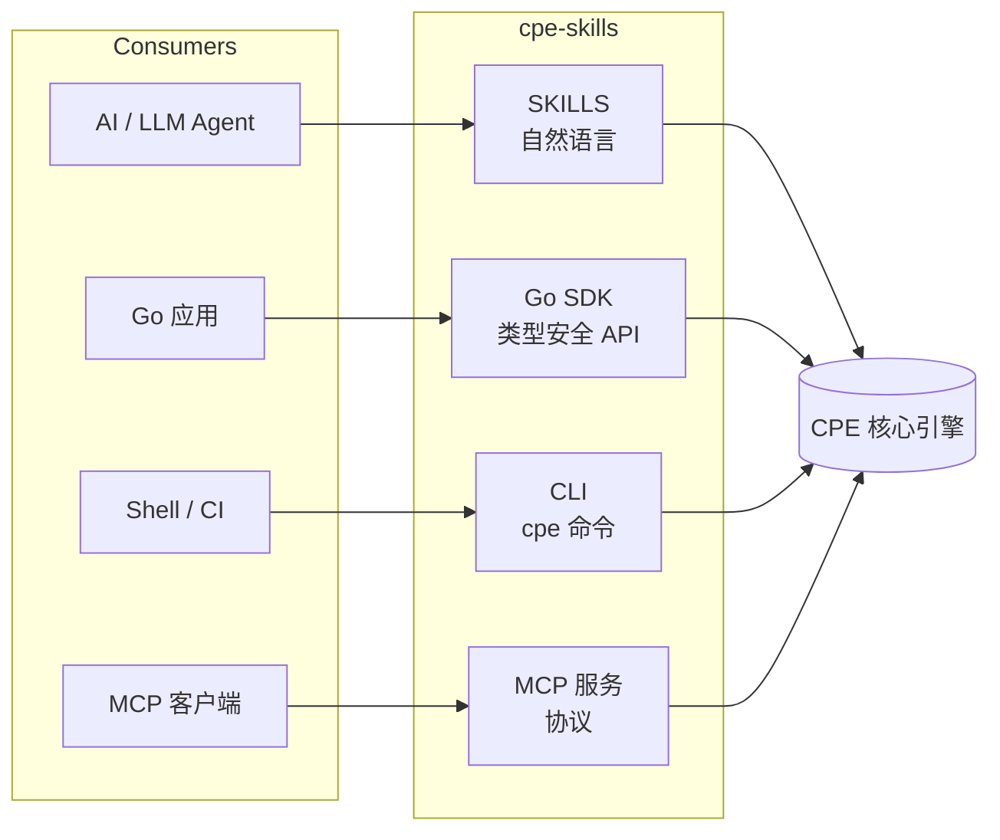
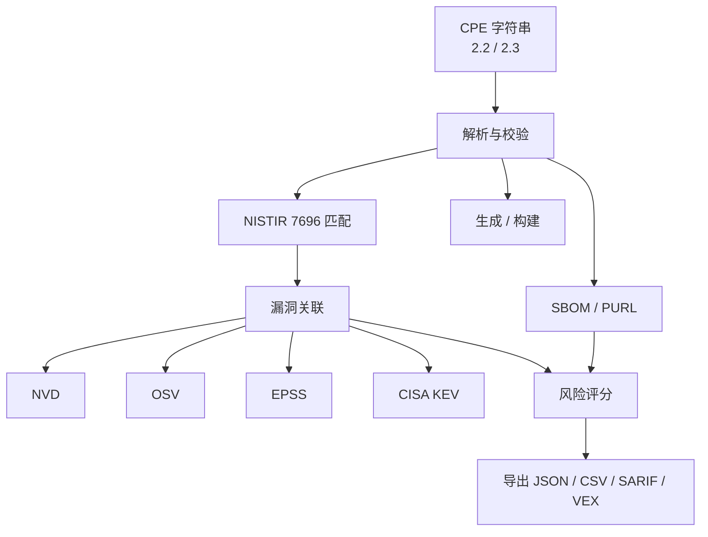

## 为什么选择 cpe-skills？

CPE 是 NIST 标准命名方案（NIST IR 7695/7696），用于标识 IT 系统和软件 —— 它是 CVE 漏洞匹配、SBOM 跟踪和供应链安全的基石。但 CPE 很难用：两种不兼容格式、复杂的 WFN 绑定、多源漏洞数据、SBOM 桥接。

**cpe-skills 解决了这一切** —— 单一工具包覆盖从解析到漏洞管理的完整 CPE 生命周期。

## 四条集成路径



### 1. SKILLS —— 面向 AI / LLM

添加到你的 Claude Code skills 配置：

```
https://github.com/scagogogo/cpe-skills
```

### 2. Go SDK

```bash
go get github.com/scagogogo/cpe-skills
```

```go
c, _ := cpeskills.Parse("cpe:2.3:a:microsoft:windows:10:*:*:*:*:*:*:*")
fmt.Println(c.Vendor, c.ProductName, c.Version)
```

### 3. CLI

```bash
# 通过 Go 安装
go install github.com/scagogogo/cpe-skills/cmd/cpe@latest

# 或从 Releases 下载预编译二进制（108 个平台）
cpe parse "cpe:2.3:a:microsoft:windows:10:*:*:*:*:*:*:*"
cpe match "cpe:2.3:a:apache:log4j:2.14.1:*:*:*:*:*:*:*" \
         "cpe:2.3:a:apache:log4j:2.14.1:*:*:*:*:*:*:*"
```

### 4. MCP（模型上下文协议）

```json
{
  "mcpServers": {
    "cpe-skills": {
      "command": "cpe",
      "args": ["mcp", "serve"]
    }
  }
}
```

## 数据流



## 功能脑图


## 文档

- [使用指南](/zh/guide/) — 实用使用示例
- [API 参考](/zh/api/) — 完整 API 文档
- [GitHub 仓库](https://github.com/scagogogo/cpe-skills) — 源码、发布、问题
